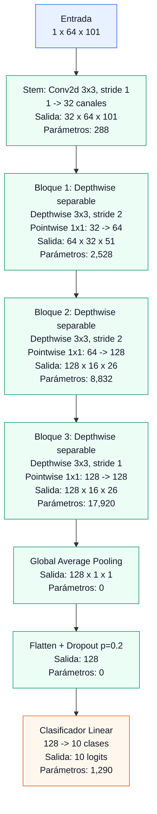

# Explicación del repositorio

Este proyecto clasifica diez comandos de voz de Speech Commands v0.02:

`yes`, `no`, `up`, `down`, `left`, `right`, `on`, `off`, `stop` y `go`.

El flujo general es:

```text
.wav
  |
  |  descarga y filtrado
  v
Speech Commands 10 clases
  |
  |  mel-spectrograma: n_fft=400, hop_length=160, 64 mels, 1 segundo
  v
caché .pt + metadata.json
  |
  |  split reproducible 70/15/15
  v
DataLoader
  |
  |  opcionalmente SpecAugment o augmentación desde waveform
  v
MobileNetStyleCNN
  |
  v
logits de 10 clases -> loss, accuracy, F1
  |
  +--> W&B
  +--> checkpoint PyTorch
  +--> ONNX + verificación de paridad
```

## Estructura

```text
data/                  Descarga y preparación de audio
preprocessing/          Caché, lectura y aumento de datos
models/                 Arquitectura neuronal
configs/                Configuraciones de experimentos
scripts/                Utilidades auxiliares
train.py               Entrenamiento individual
run_experiments.py     Seis entrenamientos comparables
export_onnx.py         Exportación y prueba ONNX
README.md              Inicio rápido
WORK.md                Guía operativa paso a paso
```

## Archivos y funciones

### `data/download_and_prepare.py`

Prepara el dataset original para este proyecto.

- `DATASET_URL`: URL del archivo oficial Speech Commands v0.02.
- `ARCHIVE_NAME`: nombre local del archivo comprimido.
- `TARGET_COMMANDS`: las diez clases utilizadas.
- `SPLIT_FILES`: nombres de las listas oficiales de validación y test.
- `download_speech_commands(raw_root)`: crea la carpeta de datos, descarga el `.tar.gz` si todavía no existe y extrae el dataset.
- `copy_target_classes(source_dir, output_dir, commands)`: copia únicamente las clases objetivo, filtra las listas oficiales y copia `_background_noise_` cuando está disponible.
- `main()`: expone el comando CLI `--root` y `--output-dir`.

Salida típica:

```text
data/speech_commands_10/
├── yes/*.wav
├── no/*.wav
├── ...
├── _background_noise_/*.wav
├── validation_list.txt
└── testing_list.txt
```

### `preprocessing/dataset.py`

Convierte los audios en espectrogramas y permite leer el caché.

Constantes importantes:

- `SAMPLE_RATE = 16000`: frecuencia de muestreo objetivo.
- `CLIP_SAMPLES = 16000`: cada ejemplo ocupa un segundo.
- `DEFAULT_N_MELS = 64`: número de bandas mel por defecto.
- `LABELS`: orden fijo de las diez clases.
- `LABEL_TO_INDEX`: conversión de nombre de clase a entero.

Funciones:

- `CacheItem`: estructura de un elemento del caché. Guarda el `.pt`, la etiqueta, el split de metadata y `wav_path`.
- `_fix_length(waveform)`: recorta audios largos a un segundo o rellena los cortos con ceros.
- `_create_mel_transform(sample_rate, n_mels)`: crea el transform `MelSpectrogram` con `n_fft=400`, `win_length=400` y `hop_length=160`.
- `_wav_files(data_dir)`: enumera los `.wav` de las diez clases en orden estable.
- `_official_splits(data_dir)`: lee `validation_list.txt` y `testing_list.txt` para guardar esa información en metadata.
- `_mel_spectrogram(wav_path, transform, sample_rate)`: carga el audio, lo remuestrea si es necesario, fija su longitud y calcula el espectrograma mel en dB.
- `cache_mel_spectrograms(data_dir, cache_dir, sample_rate, n_mels)`: calcula media y desviación globales, normaliza cada espectrograma, guarda los `.pt` y escribe `metadata.json`.
- `MelSpectrogramDataset`: dataset de PyTorch para leer los espectrogramas cacheados.
  - `__len__()`: número de clips.
  - `__getitem__(index)`: devuelve `(spectrogram, label)`.
  - `split_indices()`: recupera los splits guardados en metadata. El entrenamiento actual usa `train.split_dataset()` para crear el split semilla 70/15/15.

`metadata.json` contiene, entre otros campos:

```json
{
  "sample_rate": 16000,
  "n_mels": 64,
  "mean": -X,
  "std": Y,
  "data_dir": "/ruta/absoluta/al/dataset",
  "labels": ["yes", "no", "up", "down", "left", "right", "on", "off", "stop", "go"],
  "items": [
    {
      "spectrogram_path": "yes/example.pt",
      "label": 0,
      "split": "train",
      "wav_path": "yes/example.wav"
    }
  ]
}
```

### `preprocessing/augmentation.py`

Implementa aumento de datos sin contaminar validación ni test.

- `SpecAugment`: aplica máscaras aleatorias en frecuencia y tiempo sobre el espectrograma normalizado. Usa como valor de máscara la media del espectrograma, que normalmente está cerca de cero después de la normalización. Está inspirado en Park et al., 2019.
- `AugmentedDataset`: recibe otro dataset y aplica únicamente `SpecAugment` al elemento que lee.
- `WaveformAugmentedDataset`: recibe explícitamente los índices de train. Para cada ejemplo aumentado:
  1. carga el `.wav` original usando `wav_path`;
  2. convierte a mono y remuestrea;
  3. aplica time shifting con relleno de ceros;
  4. añade un segmento de `_background_noise_` con SNR aleatorio;
  5. aplica opcionalmente pitch shifting o speed perturbation;
  6. calcula el mismo mel-spectrograma que el caché;
  7. usa la media y desviación del entrenamiento guardadas en metadata;
  8. aplica SpecAugment.
- `_load_noise_waveforms(noise_dir)`: carga los clips de ruido una sola vez al construir el dataset.
- `_source_path(item_index)`: resuelve la ruta original y produce un error claro si el caché no tiene `wav_path`.
- `_time_shift(waveform)`: desplaza aleatoriamente el audio hasta `max_shift_ms`.
- `_noise_injection(waveform)`: mezcla ruido ajustado al SNR pedido.
- `_optional_waveform_effects(waveform)`: aplica los efectos opcionales lentos de torchaudio.

`p_augment` permite devolver el espectrograma limpio una parte del tiempo. Así el modelo puede ver tanto ejemplos aumentados como originales.

### `models/model_b.py`

Contiene la red neuronal escrita directamente con `torch.nn`.

- `DepthwiseSeparableConv`: bloque MobileNet-V1 con:
  1. convolución depthwise 3x3;
  2. BatchNorm;
  3. ReLU;
  4. convolución pointwise 1x1;
  5. BatchNorm;
  6. ReLU.
- `MobileNetStyleCNN`: modelo completo.
  - `stem`: convolución inicial de un canal a 32 canales.
  - `features`: tres bloques depthwise-separable.
  - `pool`: average pooling global a `1x1`.
  - `dropout`: regularización antes del clasificador.
  - `classifier`: capa lineal de 128 a 10 clases.
  - `forward(x)`: devuelve logits con forma `(batch, 10)`.
  - `count_parameters()`: cuenta parámetros entrenables.
  - `estimate_macs(input_shape)`: estima MACs de convoluciones y capa lineal usando hooks propios.

Para la configuración por defecto, las formas principales son:

```text
entrada       1 x 64 x 101
stem         32 x 64 x 101
bloque 1     64 x 32 x 51
bloque 2    128 x 16 x 26
bloque 3    128 x 16 x 26
pooling     128 x 1 x 1
salida       10 logits
```

### Diagrama Mermaid



El modelo completo tiene `31,370` parámetros entrenables y aproximadamente `16,617,728` MACs por ejemplo de entrada.

### `train.py`

Es el entrypoint de entrenamiento individual.

- `set_seed(seed)`: fija las semillas de Python, NumPy y PyTorch y configura determinismo de cuDNN.
- `split_dataset(dataset, seed)`: mezcla los índices originales con una semilla fija y separa 70% train, 15% validation y 15% test.
- `create_loaders(...)`: crea los tres `DataLoader`. Solo modifica train; validation y test leen siempre los espectrogramas limpios.
- `confusion_matrix(preds, labels, num_classes)`: calcula la matriz de confusión.
- `per_class_f1_from_cm(cm)`: calcula F1 de cada clase.
- `macro_f1_from_cm(cm)`: calcula el promedio macro de F1.
- `evaluate(model, dataloader, criterion, device)`: calcula loss, accuracy, F1, F1 por clase, matriz, predicciones y etiquetas.
- `_checkpoint_config(args)`: convierte argumentos, incluyendo `Path`, a una configuración serializable.
- `save_checkpoint(...)`: guarda epoch, pesos, configuración, normalización y etiquetas.
- `train(args)`: ejecuta el entrenamiento completo:
  - prepara el caché si se pidió;
  - crea loaders y modelo;
  - configura Adam, weight decay y scheduler;
  - inicializa W&B;
  - registra parámetros y MACs;
  - entrena por épocas;
  - guarda el mejor checkpoint según validation F1;
  - aplica early stopping si está activado;
  - evalúa el mejor checkpoint en test;
  - registra métricas, matriz de confusión y F1 por clase.
- `parse_args()`: define todos los flags de CLI.

Modos de `--augment-mode`:

- `none`: usa espectrogramas cacheados sin aumento.
- `specaugment`: aplica únicamente máscaras al train.
- `full`: reconstruye el espectrograma desde waveform, aplica audio augmentation y después SpecAugment.

### `configs/experiments.py`

Define `EXPERIMENTS`, una lista con tres configuraciones. Las mismas configuraciones se usan en modo base y aumentado para que la comparación sea justa. Cambian learning rate, width multiplier, dropout, batch size y weight decay.

### `run_experiments.py`

Ejecuta los seis runs:

```text
base      x balanced
base      x regularized
base      x compact
augmented x balanced
augmented x regularized
augmented x compact
```

- `_args_for_run(...)`: combina parámetros comunes y la configuración de cada experimento.
- `main()`: ejecuta los seis entrenamientos, guarda checkpoints separados, crea `results/summary.csv` y publica una tabla comparativa en W&B.

### `scripts/draw_architecture.py`

Registra hooks en las capas hoja de la red y muestra:

- nombre de capa;
- forma de salida;
- número de parámetros.

Al final imprime los parámetros totales y los MACs estimados.

### `export_onnx.py`

Exporta el mejor checkpoint a ONNX y comprueba la paridad.

- `parse_args()`: configura checkpoint, caché, salida, semilla y número de ejemplos.
- `build_test_loader(...)`: reconstruye el mismo split 70/15/15 y selecciona ejemplos de test.
- `main()`: carga la arquitectura desde la configuración del checkpoint, exporta con opset 17 y compara logits de PyTorch contra ONNX Runtime mediante `np.testing.assert_allclose`.

### `README.md`

Contiene los comandos de inicio rápido: instalación, descarga, caché, runs individuales, seis experimentos, exportación ONNX y resumen de arquitectura.

## Archivos generados

```text
data/spectrogram_cache/
├── yes/*.pt
├── ...
└── metadata.json

checkpoints/
└── <run_name>/best_model.pt

results/
└── summary.csv
```

W&B mantiene además el historial de loss, accuracy, F1, learning rate, gaps, matriz de confusión y F1 por clase.
